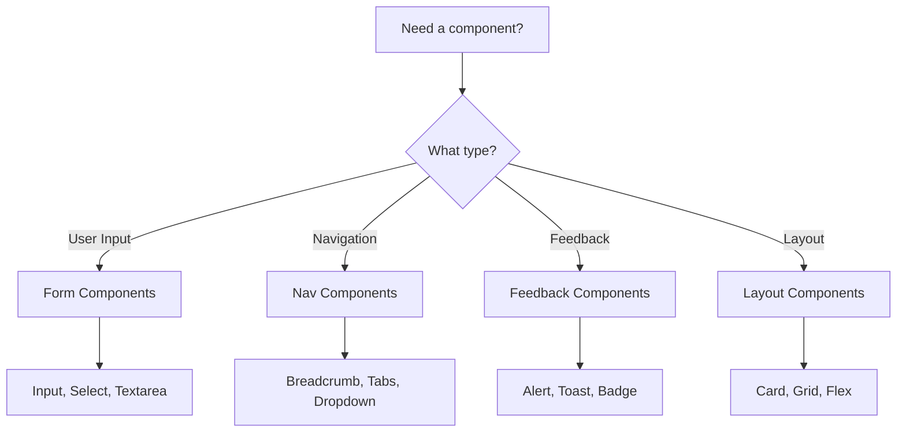

# Learn Vanguard Design System

**Version 1.0.0** | Last Updated: November 2025

---

## Table of Contents

1. [Introduction](#introduction)
2. [Design Tokens](#design-tokens)
3. [Typography](#typography)
4. [Color System](#color-system)
5. [Spacing](#spacing)
6. [Shadows & Elevation](#shadows--elevation)
7. [Components](#components)
8. [Accessibility](#accessibility)
9. [Usage Guidelines](#usage-guidelines)

---

## Introduction

The Learn Vanguard Design System provides a comprehensive set of design tokens, components, and guidelines to ensure consistency across the Student Resource Hub platform. This system follows industry best practices and WCAG 2.1 AA accessibility standards.

### Key Principles

- **Consistency**: Uniform design language across all features
- **Accessibility**: WCAG 2.1 AA compliant
- **Scalability**: Token-based system for easy maintenance
- **Performance**: Optimized components with lazy loading
- **Mobile-First**: Responsive design by default

---

## Design Tokens

Design tokens are the foundation of our design system. All tokens are defined as CSS custom properties and integrated with Tailwind CSS.

### Token Structure

```
src/styles/tokens/
├── spacing.css      # Spacing scale
├── typography.css   # Type system
├── colors.css       # Color palette
└── shadows.css      # Elevation system
```

### Why Tokens?

- Single source of truth
- Easy theme switching (light/dark mode)
- Centralized updates
- Design-development alignment

---

## Typography

### Font Family

**Primary Font**: Poppins (400, 500, 600, 700)

```css
--font-primary: "Poppins", -apple-system, BlinkMacSystemFont, "Segoe UI", sans-serif;
```

### Type Scale

| Name | Size | Line Height | Letter Spacing | Usage |
|------|------|-------------|----------------|-------|
| Display | 60px | 72px | -0.02em | Hero sections |
| H1 | 48px | 56px | -0.015em | Page titles |
| H2 | 36px | 44px | -0.01em | Section headers |
| H3 | 30px | 36px | -0.01em | Sub-sections |
| H4 | 24px | 32px | -0.005em | Card titles |
| H5 | 20px | 28px | -0.005em | Small headings |
| H6 | 18px | 28px | 0 | Smallest headings |
| Body Large | 18px | 28px | 0 | Emphasized text |
| Body | 16px | 24px | 0 | Default body text |
| Body Small | 14px | 20px | 0 | Secondary text |
| Caption | 12px | 16px | 0.01em | Labels, captions |
| Overline | 10px | 14px | 0.08em | Overline text |

### Responsive Typography

On mobile devices (< 768px):
- Display: 40px → 48px
- H1: 32px → 40px
- H2: 28px → 36px

### Usage Examples

#### Tailwind Classes
```jsx
<h1 className="text-h1 font-bold">Page Title</h1>
<p className="text-body">Regular paragraph text</p>
<small className="text-caption text-muted-foreground">Helper text</small>
```

#### Custom CSS Classes
```jsx
<h1 className="heading-1">Page Title</h1>
<p className="body">Regular paragraph text</p>
<span className="caption">Helper text</span>
```

---

## Color System

### Brand Colors

#### Primary (Blue)
```css
--primary: 221.2 83.2% 53.3%        /* Main brand color */
--primary-hover: 221.2 83.2% 45%    /* Hover state */
--primary-active: 221.2 83.2% 40%   /* Active/pressed state */
--primary-foreground: 210 40% 98%   /* Text on primary */
```

**Usage**: Primary actions, links, brand elements

#### Secondary (Blue-Gray)
```css
--secondary: 210 40% 96.1%          /* Light background */
--secondary-hover: 210 40% 92%      /* Hover state */
--secondary-foreground: 222.2 47.4% 11.2%
```

**Usage**: Secondary actions, alternative buttons

### Semantic Colors

#### Success (Green)
```css
--success: 142 76% 36%
--success-foreground: 0 0% 100%
--success-light: 142 76% 96%
```
**Usage**: Success messages, completed states, positive indicators

#### Warning (Orange)
```css
--warning: 38 92% 50%
--warning-foreground: 0 0% 100%
--warning-light: 38 92% 95%
```
**Usage**: Warnings, cautions, important notices

#### Error (Red)
```css
--error: 0 84.2% 60.2%
--error-foreground: 210 40% 98%
--error-light: 0 84.2% 97%
```
**Usage**: Errors, destructive actions, form validation

#### Info (Cyan)
```css
--info: 199 89% 48%
--info-foreground: 0 0% 100%
--info-light: 199 89% 96%
```
**Usage**: Informational messages, tips, help text

### Educational Theme Colors

```css
--learning: 142 76% 36%       /* Green - learning/growth */
--achievement: 45 93% 47%     /* Gold - achievements */
--resource: 221.2 83.2% 53.3% /* Blue - resources */
--task: 271 91% 65%           /* Purple - tasks */
--event: 338 78% 56%          /* Pink - events */
--deadline: 0 84.2% 60.2%     /* Red - deadlines */
```

### Chart Colors

Six distinct colors for data visualization:
```css
--chart-1: 221.2 83.2% 53.3%  /* Blue */
--chart-2: 142 76% 36%        /* Green */
--chart-3: 271 91% 65%        /* Purple */
--chart-4: 38 92% 50%         /* Orange */
--chart-5: 338 78% 56%        /* Pink */
--chart-6: 199 89% 48%        /* Cyan */
```

### Neutral Colors

```css
--background: 0 0% 100%       /* Page background */
--foreground: 222.2 84% 4.9%  /* Text color */
--muted: 210 40% 96.1%        /* Muted backgrounds */
--muted-foreground: 215.4 16.3% 46.9%
--border: 214.3 31.8% 91.4%   /* Border color */
--border-strong: 214.3 31.8% 80%
```

### Dark Mode

All colors automatically adapt for dark mode using the `.dark` class:

```jsx
<body className="dark">
  {/* All colors automatically switch */}
</body>
```

### Usage Examples

```jsx
{/* Background colors */}
<div className="bg-primary text-primary-foreground">Primary Button</div>
<div className="bg-success text-success-foreground">Success</div>

{/* Text colors */}
<p className="text-foreground">Default text</p>
<p className="text-muted-foreground">Secondary text</p>

{/* Borders */}
<div className="border border-border">Default border</div>
<div className="border-2 border-primary">Primary border</div>
```

---

## Spacing

### 8px Base Grid

All spacing follows an 8px base grid for visual rhythm and consistency.

| Token | Value | Pixels | Usage |
|-------|-------|--------|-------|
| spacing-0 | 0 | 0px | No spacing |
| spacing-1 | 0.25rem | 4px | Micro spacing |
| spacing-2 | 0.5rem | 8px | Base unit |
| spacing-3 | 0.75rem | 12px | Tight spacing |
| spacing-4 | 1rem | 16px | Standard spacing |
| spacing-5 | 1.25rem | 20px | Medium spacing |
| spacing-6 | 1.5rem | 24px | Relaxed spacing |
| spacing-8 | 2rem | 32px | Section spacing |
| spacing-10 | 2.5rem | 40px | Large spacing |
| spacing-12 | 3rem | 48px | XL spacing |
| spacing-16 | 4rem | 64px | Section dividers |
| spacing-20 | 5rem | 80px | Major sections |
| spacing-24 | 6rem | 96px | Hero spacing |

### Semantic Spacing

```css
--spacing-section: 64px        /* Between major sections */
--spacing-card-padding: 24px   /* Internal card padding */
--spacing-container: 32px      /* Container padding */
--spacing-stack-tight: 8px     /* Tight vertical rhythm */
--spacing-stack-default: 16px  /* Default vertical rhythm */
--spacing-stack-relaxed: 24px  /* Relaxed vertical rhythm */
```

### Touch Targets

```css
--touch-target-min: 44px          /* Minimum (WCAG) */
--touch-target-comfortable: 48px  /* Comfortable size */
```

### Usage Examples

```jsx
{/* Padding */}
<div className="p-4">16px padding all sides</div>
<div className="px-6 py-4">24px horizontal, 16px vertical</div>

{/* Margins */}
<div className="mb-8">32px bottom margin</div>
<div className="mt-12">48px top margin</div>

{/* Gaps (Flexbox/Grid) */}
<div className="flex gap-4">16px gap between children</div>
<div className="grid grid-cols-3 gap-6">24px gap</div>
```

---

## Shadows & Elevation

### 5-Level Elevation System

| Level | Shadow | Usage |
|-------|--------|-------|
| 0 | None | Flat elements |
| 1 | sm | Cards at rest, subtle lift |
| 2 | md | Cards on hover, dropdowns |
| 3 | lg | Modals, popovers |
| 4 | xl | Important modals |
| 5 | 2xl | Critical overlays, notifications |

### Shadow Definitions

```css
--shadow-sm: 0 1px 2px 0 hsl(var(--shadow-color) / 0.05)

--shadow-md:
  0 2px 4px -1px hsl(var(--shadow-color) / 0.05),
  0 4px 6px -1px hsl(var(--shadow-color) / 0.1)

--shadow-lg:
  0 4px 6px -2px hsl(var(--shadow-color) / 0.1),
  0 10px 15px -3px hsl(var(--shadow-color) / 0.15)
```

### Specialized Shadows

```css
--shadow-inner       /* Inset effects */
--shadow-focus       /* Focus rings */
--shadow-glow-primary   /* Glowing effects */
--shadow-primary     /* Colored shadows */
```

### Usage Examples

```jsx
{/* Basic elevation */}
<div className="shadow-sm">Level 1 elevation</div>
<div className="shadow-lg">Level 3 elevation</div>

{/* With hover transitions */}
<div className="shadow-md hover:shadow-lg transition-shadow">
  Hover to elevate
</div>

{/* Utility classes */}
<div className="elevation-2">Using utility class</div>
<div className="hover-elevation hover-elevation-3">Hover effect</div>
```

---

## Components

### Button

**Variants**: `default`, `destructive`, `outline`, `secondary`, `ghost`, `link`

**Sizes**: `default`, `sm`, `lg`, `icon`

```jsx
import { Button } from "@/components/ui/button"

<Button variant="default" size="default">Primary Button</Button>
<Button variant="outline" size="sm">Small Outline</Button>
<Button variant="destructive">Delete</Button>
```

**Touch Targets**: All buttons have `min-h-[44px]` for accessibility.

### Card

**Structure**: Card, CardHeader, CardTitle, CardDescription, CardContent, CardFooter

```jsx
import { Card, CardHeader, CardTitle, CardContent } from "@/components/ui/card"

<Card>
  <CardHeader>
    <CardTitle>Card Title</CardTitle>
  </CardHeader>
  <CardContent>
    Card content goes here
  </CardContent>
</Card>
```

### Modal/Dialog

**Enhanced with Focus Trapping** (Phase 1 improvement)

```jsx
import BaseModal from "@/components/ui/BaseModal"

<BaseModal
  isOpen={isOpen}
  onClose={handleClose}
  title="Modal Title"
  description="Optional description"
  maxWidth="md"
>
  <p>Modal content</p>
</BaseModal>
```

**Features**:
- Automatic focus trapping
- Keyboard navigation (Tab, Esc)
- Click outside to close
- Loading states
- Multiple sizes: `sm`, `md`, `lg`, `xl`, `2xl`, `full`

### Input

**Enhanced with Floating Labels**

```jsx
import FloatingLabelInput from "@/components/ui/FloatingLabelInput"

<FloatingLabelInput
  label="Email"
  type="email"
  value={email}
  onChange={setEmail}
  error={errors.email}
/>
```

### Full Component List

- **Forms**: Input, FloatingLabelInput, PasswordInput, SelectInput, Textarea, Label, Radio Group
- **Navigation**: Breadcrumb, Tabs, Dropdown Menu
- **Feedback**: Alert, Toast, Toaster, Progress, Skeleton, Badge
- **Overlays**: Dialog, Alert Dialog, BaseModal, PopoverModal, Tooltip, Sheet
- **Layout**: Card, Separator, Scroll Area
- **Data Display**: Table, Pagination, Calendar, Chart
- **Accessibility**: PermissionGuard, SkipNav (Phase 1)

---

## Accessibility

### WCAG 2.1 AA Compliance

Phase 1 implements critical accessibility features:

#### 1. Skip Navigation Links

Allows keyboard users to skip to main content:

```jsx
// Automatically included in App.jsx
<SkipNav />
```

**Keyboard**: Press `Tab` on page load to reveal skip links.

#### 2. Focus Trapping in Modals

All modals trap focus within the dialog:

```js
import { useFocusTrap } from "@/hooks/useFocusTrap"

const trapRef = useFocusTrap(isOpen)
<div ref={trapRef}>...</div>
```

#### 3. Enhanced Focus Indicators

**Visible focus states** for all interactive elements:

```css
/* Automatically applied via foundations/focus.css */
*:focus-visible {
  outline: 2px solid hsl(var(--ring));
  outline-offset: 2px;
  box-shadow: 0 0 0 4px hsl(var(--ring) / 0.1);
}
```

#### 4. Color Contrast

All color combinations meet WCAG AA standards (4.5:1 for text).

#### 5. Touch Targets

Minimum 44x44px touch targets:

```jsx
<button className="min-h-touch min-w-touch">
  Accessible Button
</button>
```

#### 6. Semantic HTML

```jsx
<main id="main-content">   {/* Skip link target */}
  <nav id="navigation">    {/* Skip link target */}
    ...
  </nav>
  <article role="article">
    <h1>Proper heading hierarchy</h1>
  </article>
</main>
```

#### 7. ARIA Attributes

All components include proper ARIA:

```jsx
<button
  aria-label="Close modal"
  aria-describedby="modal-description"
>
  <X />
</button>
```

#### 8. Automated Testing

**Axe-core integration** (development mode):

```js
// Automatically initialized in main.jsx
import { initAxe } from "./lib/axe.js"
initAxe() // Logs violations to console
```

### Accessibility Checklist

- [ ] All images have alt text
- [ ] Forms have proper labels
- [ ] Headings follow hierarchy (h1→h2→h3)
- [ ] Color is not the only indicator
- [ ] All interactive elements are keyboard accessible
- [ ] Focus indicators are visible
- [ ] ARIA attributes are used correctly
- [ ] Content is responsive and readable at 200% zoom

---

## Usage Guidelines

### Component Selection



### Layout Patterns

#### Container
```jsx
<div className="container mx-auto px-4 sm:px-6 lg:px-8">
  {/* Content */}
</div>
```

#### Grid Layout
```jsx
<div className="grid grid-cols-1 md:grid-cols-2 lg:grid-cols-3 gap-6">
  <Card>Column 1</Card>
  <Card>Column 2</Card>
  <Card>Column 3</Card>
</div>
```

#### Flexbox
```jsx
<div className="flex flex-col md:flex-row gap-4 items-center justify-between">
  <div>Left content</div>
  <div>Right content</div>
</div>
```

### Responsive Design

```jsx
{/* Mobile-first approach */}
<div className="
  text-sm           // Default (mobile)
  md:text-base      // Tablet
  lg:text-lg        // Desktop
  p-4               // Default padding
  md:p-6            // Tablet padding
  lg:p-8            // Desktop padding
">
  Responsive content
</div>
```

### Dark Mode

```jsx
{/* Automatic dark mode support */}
<div className="
  bg-white dark:bg-gray-900
  text-gray-900 dark:text-white
  border border-gray-200 dark:border-gray-700
">
  Theme-aware content
</div>
```

### Animation & Transitions

```jsx
{/* Smooth transitions */}
<button className="
  transition-all duration-200
  hover:scale-105
  active:scale-95
">
  Animated Button
</button>

{/* Respect reduced motion */}
<div className="
  motion-safe:animate-fade-in
  motion-reduce:opacity-100
">
  Accessible animation
</div>
```

---

## Best Practices

### DO ✅

- Use design tokens instead of hardcoded values
- Follow the 8px spacing grid
- Maintain proper heading hierarchy
- Include focus indicators
- Test keyboard navigation
- Provide loading states
- Use semantic HTML
- Add ARIA labels where needed

### DON'T ❌

- Override token values without reason
- Use arbitrary spacing (e.g., `px-[13px]`)
- Skip heading levels (h1 → h3)
- Remove focus outlines
- Forget mobile responsiveness
- Use `<div>` for everything
- Ignore accessibility warnings

---

## Resources

### Documentation
- [Tailwind CSS](https://tailwindcss.com/)
- [shadcn/ui](https://ui.shadcn.com/)
- [Radix UI](https://www.radix-ui.com/)
- [WCAG 2.1](https://www.w3.org/WAI/WCAG21/quickref/)

### Tools
- [Axe DevTools](https://www.deque.com/axe/devtools/)
- [WAVE](https://wave.webaim.org/)
- [Contrast Checker](https://webaim.org/resources/contrastchecker/)

### Internal
- Component source: `src/components/ui/`
- Design tokens: `src/styles/tokens/`
- Examples: Check existing pages in `src/app/pages/`

---

## Changelog

### Version 1.0.0 (November 2025) - Phase 1

**Design Token System**
- Created comprehensive spacing scale (8px grid)
- Implemented systematic typography scale
- Enhanced color system with semantic and educational colors
- Added 5-level shadow/elevation system

**Accessibility Improvements**
- Skip navigation links
- Focus trapping in modals
- Enhanced focus indicators
- Axe-core integration for testing

**Performance Optimizations**
- Code splitting on routes
- Removed unused dependencies (Redux, Zustand)
- Lazy loading components

**Developer Experience**
- Design system documentation
- Token-based styling
- Consistent component API

---

**Maintained by**: Learn Vanguard Team
**Last Updated**: November 14, 2025
**Version**: 1.0.0
