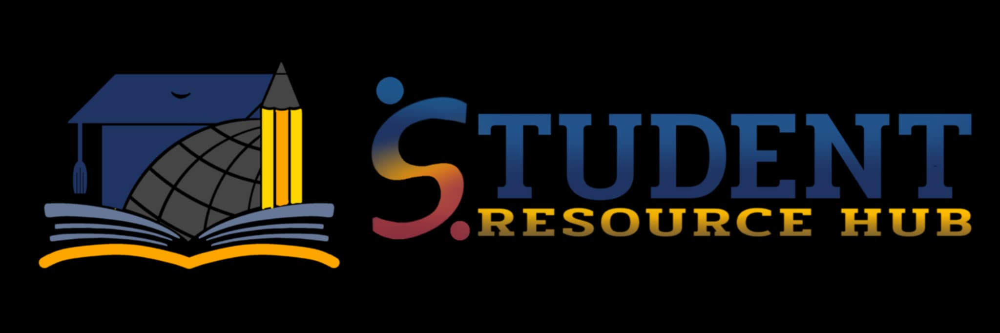

<div align="center">

# LEARN VANGUARD
## Student Resource Hub

[](https://choosealicense.com/licenses/mit/)
[](https://learn-vanguard.vercel.app/)
[](https://reactjs.org/)
[](https://vitejs.dev/)

*Empowering Students, Enabling Excellence.*



</div>

## 📋 Table of Contents
- [Mission & Vision](#-mission--vision)
- [Why Learn Vanguard?](#-why-learn-vanguard)
- [Features](#-features)
- [Technology Stack](#️-technology-stack)
- [Our Team](#-our-team)
- [Development](#-development)
- [Project Status](#-project-status)
- [Contact](#-contact)
- [License](#-license)

## 🎯 Mission & Vision

### Mission
"To empower students by providing a centralized, accessible platform that enhances learning, fosters collaboration, and streamlines access to essential academic resources."

### Vision
"To create a thriving educational ecosystem where students and the institution are seamlessly connected, enabling every student to access the tools and support needed for academic and personal growth."

## 💡 Why Learn Vanguard?

### The Power of "Learn"
At our core, we are dedicated to education and knowledge acquisition. "Learn" represents our commitment to:
- Facilitating meaningful educational experiences
- Providing comprehensive learning resources
- Supporting personal and academic development
- Creating an environment conducive to growth

### The Spirit of "Vanguard"
As pioneers in educational technology, "Vanguard" embodies our dedication to:
- Leading innovation in educational solutions
- Setting new standards in academic resource management
- Embracing cutting-edge technologies
- Revolutionizing the learning experience

## ✨ Key Features

### 🎯 Integrated Academic Resource Center
- Centralized access to course materials and study resources
- Real-time announcements and updates
- Downloadable lecture materials and supplementary content

### 📊 Academic Progress Navigator
- Intuitive progress tracking dashboard
- Personalized learning paths
- Task management and deadline tracking

### 🎨 Modern User Experience
- Clean, responsive design
- Dark/light mode support
- Accessible interface

## 🛠️ Technology Stack

<div align="center">

### Frontend Core
[](https://vitejs.dev/)
[](https://reactjs.org/)
[](https://tailwindcss.com/)

### Design & UI
[](https://www.figma.com/)
[](https://ui.shadcn.com/)
[](https://www.framer.com/motion/)

### Development Tools
[](https://code.visualstudio.com/)
[](https://git-scm.com/)
[](https://vercel.com/)

</div>

## 👥 Our Team

<div align="center">

## 🚀 Development Team

<table align="center">
  <tr>
    <td align="center" width="400">
      
      <br>
      
      <br>
      <b>Sidney John Sarcia</b>
      <br>
      <sub><code>Frontend Architecture | Performance Optimization</code></sub>
      <br>
      <br>
      <a href="https://github.com/szeedneigh">
        
      </a>
    </td>
    <td align="center" width="400">
      
      <br>
      
      <br>
      <b>Daniel Latina</b>
      <br>
      <sub><code>Component Development | Integration Testing</code></sub>
      <br>
      <br>
      <a href="https://github.com/Dan-903">
        
      </a>
    </td>
  </tr>
</table>

## 📊 Project Management

<table align="center">
  <tr>
    <td align="center" width="400">
      
      <br>
      
      <br>
      <b>Alicia Jane Medina</b>
      <br>
      <sub><code>Strategic Planning | Resource Allocation</code></sub>
      <br>
      <br>
      <a href="https://github.com/aliciajane-bits">
        
      </a>
    </td>
    <td align="center" width="400">
      
      <br>
      
      <br>
      <b>Shiela Mae Miclat</b>
      <br>
      <sub><code>Sprint Planning | Risk Management</code></sub>
      <br>
      <br>
      <a href="https://github.com/shills16">
        
      </a>
    </td>
  </tr>
</table>

## 🎨 Design

<table align="center">
  <tr>
    <td align="center" width="400">
      
      <br>
      
      <br>
      <b>Elloisa Degula</b>
      <br>
      <sub><code>Interface Design | Design System</code></sub>
      <br>
      <br>
      <a href="https://github.com/EMD-001">
        
      </a>
    </td>
    <td align="center" width="400">
      
      <br>
      
      <br>
      <b>Trisha Catibog</b>
      <br>
      <sub><code>Prototyping | Visual Design</code></sub>
      <br>
      <br>
      <a href="https://github.com/tshamaec">
        
      </a>
    </td>
  </tr>
</table>

## 🔍 Quality Assurance

<table align="center">
  <tr>
    <td align="center" width="400">
      
      <br>
      
      <br>
      <b>Jasmine Manansala</b>x
      <br>
      <sub><code>Test Strategy | Quality Standards</code></sub>
      <br>
      <br>
      <a href="https://github.com/jasminemanansala">
        
      </a>
    </td>
    <td align="center" width="400">
      
      <br>
      
      <br>
      <b>Allen Murphy Bactol</b>
      <br>
      <sub><code>Manual Testing | Bug Tracking</code></sub>
      <br>
      <br>
      <a href="https://github.com/Al-Mone">
        
      </a>
    </td>
  </tr>
</table>


</div>

## 🌟 Team Values
- **Innovation**: Pushing boundaries in educational technology
- **Collaboration**: Working together to achieve excellence
- **Quality**: Maintaining high standards in every aspect
- **User-Centric**: Focusing on student and institutional needs
- **Continuous Learning**: Growing together as a team

## 🚀 Development

### Prerequisites
- Node.js 16.x or higher
- npm 7.x or higher
- Git

### Environment Setup
1. **Clone the repository**
   ```bash
   git clone https://github.com/szeedneigh/learn-vanguard.git
   ```

2. **Install dependencies**
   ```bash
   cd learn-vanguard
   npm install
   ```

3. **Start development server**
   ```bash
   npm run dev
   ```

### Development Guidelines
- Follow the established coding standards
- Write unit tests for new features
- Document code changes
- Perform code reviews
- Maintain clean commit history

## 📈 Project Status

### Current Progress
- [x] Core platform architecture
- [x] User interface implementation
- [x] Basic resource management
- [ ] Advanced learning analytics
- [ ] Collaboration tools
- [ ] Mobile optimization
- [ ] Backend implementation

### Upcoming Milestones
1. **Q1 2025**
   - Advanced analytics dashboard
   - Enhanced collaboration features
   - Enhanced user experience
   - Enhanced user interface

2. **Q2 2025**
   - Backend Implementation
   - Complete Production

## 📫 Contact

### Project Inquiries
- **Email**: learnvanguard@student.resource.hub.com
- **Location**: La Verdad Christian College - Apalit

- GitHub Issues: [Report a bug](https://github.com/szeedneigh/learn-vanguard/issues)

## 📄 License

Copyright © 2024 Learn Vanguard

This project is proprietary and confidential. Unauthorized copying, modification, distribution, or use of this software is strictly prohibited.

## 🙏 Acknowledgments

- All our amazing Instructors
- Information Systems Project Management 1
- Application Development and Emerging Technologies 1
- Our dedicated team of developers, designers, project managers, and SQA
- Bachelor of Science in Information Systems 3
- La Verdad Christian College - Apalit

---

<div align="center">

Made with ❤️ by the Learn Vanguard Team

</div>